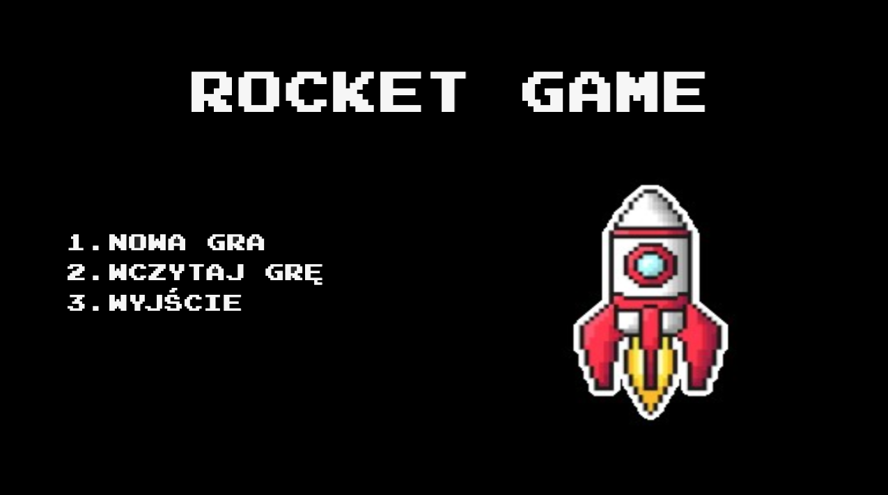
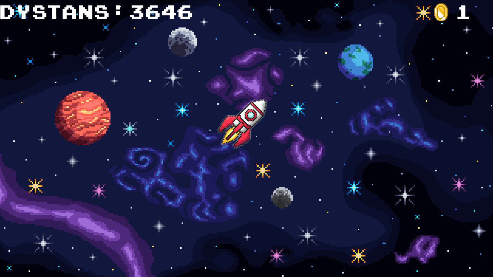
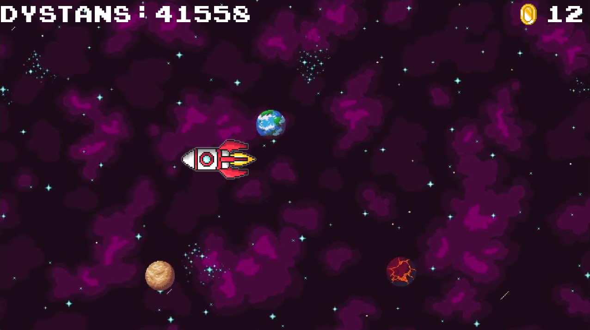

# Rocket-Game
### Simple game in C++ using SFML

I created this game in order to learn basics of SFML library.
This game involves flying a rocket through space and collecting coins for traveled distance. The background and background music change after a certain distance traveled. 
The game includes a progress saving and loading system.

This project is not too complicated and is open to expansion.

**Some screenshots from the game:**

* Main Menu

    

* Game with first background
  
  

* Game with second background (traveled distance >= 30 000)

    